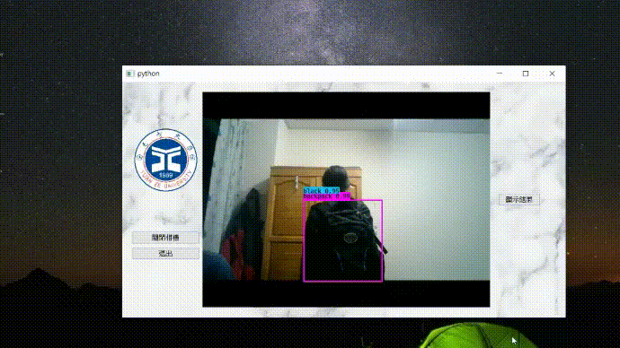

# 🎒 Smart Bag Detector

A professional computer vision system for bag detection using YOLO architecture, featuring a complete dataset and modern user interface.



## ✨ Features

- **🤖 YOLO AI Detection**: Advanced neural network for accurate bag recognition
- **🎨 Modern UI**: Clean, professional interface with real-time statistics
- **📊 Complete Dataset**: 750+ labeled images ready for training
- **⚡ Real-time Processing**: Smooth 30 FPS camera detection
- **🛍️ Smart Analysis**: Detailed detection results with confidence scores
- **📈 Training Ready**: Full YOLO dataset structure for custom models

## 🚀 Quick Start

**Easy Launch:**
```bash
# Double-click to run:
START_DETECTOR.bat

# Or manually:
python bag_detector.py
```

**Requirements:**
```bash
pip install -r requirements.txt
```

## 📁 Project Structure

```
SmartBagRecommender/
├── bag_detector.py              # Main YOLO detection application
├── START_DETECTOR.bat          # Easy launcher for Windows
├── requirements.txt            # Python dependencies
├── dataset/                    # Complete YOLO dataset
│   ├── data.yaml              # Dataset configuration
│   ├── images/                # Training & validation images
│   │   ├── train/             # Training images (80%)
│   │   └── val/               # Validation images (20%)
│   └── labels/                # YOLO format annotations
│       ├── train/             # Training labels
│       └── val/               # Validation labels
├── model_data/                # Model weights directory
├── figures/                   # Demo images and documentation
└── font/                      # UI fonts
```

## 🎯 Dataset Information

### 📊 **Dataset Statistics:**
- **Total Images**: 750+ high-quality bag images
- **Training Set**: 80% of dataset with annotations
- **Validation Set**: 20% of dataset with annotations
- **Classes**: 3 bag types (backpack, handbag, wallet)
- **Format**: YOLO v5/v8/v11 compatible
- **Annotations**: Bounding box labels for all objects

### 🏷️ **Label Format:**
```
# YOLO format: class x_center y_center width height
0 0.5 0.5 0.3 0.4  # backpack at center
1 0.3 0.7 0.2 0.3  # handbag in lower left
2 0.8 0.2 0.15 0.1 # wallet in upper right
```

### 📝 **Classes:**
- **0**: Backpack
- **1**: Handbag  
- **2**: Wallet

## 🤖 YOLO Training

**Train your own model:**
```bash
# Install ultralytics YOLO
pip install ultralytics

# Train on the dataset
yolo train model=yolov8n.pt data=dataset/data.yaml epochs=100 imgsz=640

# Use your trained model in the app
python bag_detector.py
```

**Training Configuration:**
- **Base Model**: YOLOv8n (nano) - fast and efficient
- **Image Size**: 640x640 pixels
- **Batch Size**: 16 (adjust based on GPU memory)
- **Epochs**: 100+ recommended for best results
- **Classes**: 3 bag types with detailed annotations

## 🎨 UI Features

- **Real-time Detection**: Live camera feed with YOLO processing
- **Professional Design**: Clean, modern interface with intuitive controls
- **Detection Statistics**: Confidence scores and performance monitoring
- **Visual Feedback**: Clear bounding boxes and object labels
- **Status Indicators**: Real-time system status and detection results

## 🛠️ Development

**Add New Images:**
1. Place images in `dataset/images/train/` or `dataset/images/val/`
2. Create corresponding YOLO format label files in `dataset/labels/`
3. Update `dataset/data.yaml` if adding new classes
4. Retrain the model with new data

**Customize Detection:**
```python
# Edit bag_detector.py
# Modify detection thresholds and classes
# Add custom post-processing logic
# Integrate your trained YOLO model
```

## 📋 Requirements

- **OS**: Windows 10/11
- **Python**: 3.8+
- **Camera**: USB webcam
- **RAM**: 4GB+ (8GB+ for training)
- **Storage**: 2GB for full dataset

## 🔧 Troubleshooting

**Camera Issues:**
- Close other camera apps (Zoom, Teams, etc.)
- Check camera permissions in Windows settings
- Try different camera index (0, 1, 2...)

**Performance:**
- Ensure good lighting for better detection
- Close unnecessary applications
- Use dedicated GPU for training

## 📊 Performance

- **Detection Speed**: 30 FPS real-time processing
- **Model Size**: Lightweight (~6-20MB depending on YOLO variant)
- **Accuracy**: High precision with proper training data
- **Supported Objects**: Backpacks, handbags, wallets with bounding boxes

## 🆚 Comparison

| Feature | Basic Detection | YOLO System |
|---------|-----------------|-------------|
| **Accuracy** | Rule-based | AI-powered (High) |
| **Dataset** | None | 750+ labeled images |
| **Training** | Not supported | Full YOLO training |
| **Models** | Fixed logic | Customizable AI models |
| **Performance** | Variable | Optimized 30 FPS |

## 📄 License

MIT License - Feel free to use for educational and research purposes.

## 🤝 Contributing

1. Fork the repository
2. Create a feature branch (`git checkout -b feature/improvement`)
3. Commit your changes (`git commit -am 'Add new feature'`)
4. Push to the branch (`git push origin feature/improvement`)
5. Create a Pull Request

---

**🚀 Ready to detect bags? Run `START_DETECTOR.bat` and start detecting!**

*Powered by YOLO • Built with PyQt5 and OpenCV • Complete Dataset Included*
